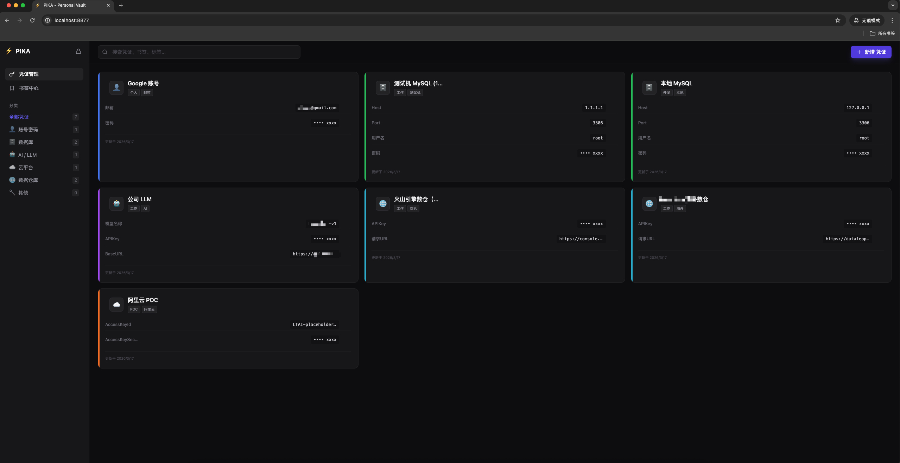

# ⚡ PIKA

> **Personal Intelligent Key Archive (个人智能密钥库)**  
> 专为开发者打造的优雅、自托管的机密保险库与书签管理器。


<!-- Screenshot Placeholder -->
<div align="center">
  
  <p><em>安全 · 极速 · 本地优先</em></p>
</div>

---

## ✨ 核心特性

<table>
  <tr>
    <td width="50%" valign="top">
      <h3>🔐 机密保险库</h3>
      <ul>
        <li><strong>AES-256-GCM 加密</strong>: 所有敏感字段均采用军工级加密标准。</li>
        <li><strong>零知识架构</strong>: 主密钥由你的密码派生，绝不存储在磁盘上。</li>
        <li><strong>自动锁定</strong>: 锁定或超时后立即清除内存中的密钥。</li>
        <li><strong>结构化数据</strong>: 针对 API Key、数据库凭证、云服务密钥优化的模板。</li>
        <li><strong>一键复制</strong>: 瞬间解密并复制到剪贴板。</li>
      </ul>
    </td>
    <td width="50%" valign="top">
      <h3>🔖 书签中心</h3>
      <ul>
        <li><strong>智能抓取</strong>: 自动获取网页标题和图标。</li>
        <li><strong>工作流管理</strong>: 高效组织开发工具、仪表盘和文档。</li>
        <li><strong>统一搜索</strong>: 跨凭证和书签的模糊搜索。</li>
        <li><strong>标签系统</strong>: 灵活的项目分类管理。</li>
      </ul>
    </td>
  </tr>
</table>

---

## 🚀 快速开始

两分钟内完成部署并开始使用。

### 环境要求
*   macOS (针对 Apple Silicon 优化)
*   Python 3.9+
*   MySQL 8.0+

### 安装步骤

1.  **克隆仓库**
    ```bash
    git clone https://github.com/your-username/pika.git
    cd pika
    ```

2.  **配置环境**
    ```bash
    cp .env.example .env
    # 编辑 .env 文件，填入你的 MySQL 数据库信息
    nano .env
    ```

3.  **启动 PIKA**
    ```bash
    ./start.sh
    ```
    此脚本将自动安装依赖、初始化数据库并启动后端服务。

4.  **访问应用**
    在浏览器中打开 **[http://localhost:8877](http://localhost:8877)**。

---

## ⚡ macOS Spotlight 集成

通过 Spotlight (Cmd+Space) 瞬间唤起 PIKA。

1.  **安装应用程序**
    生成应用包（需要先配置好 `start.sh`）：
    ```bash
    # (可选) 如果你在本地生成了 PIKA.app，将其移动到应用程序目录
    mv PIKA.app /Applications/
    ```

2.  **唤起**
    *   按下 `Cmd + Space`
    *   输入 `PIKA`
    *   回车

PIKA 将自动确保后端服务运行并打开你的保险库。

---

## 🔒 安全架构

*   **加密算法**: 所有敏感数据（密码、密钥）均使用 `AES-256-GCM` 加密。
*   **密钥派生**: 主密钥使用 `PBKDF2` (SHA-256) 算法结合随机盐值派生。
*   **仅限内存**: 主密钥仅存在于 RAM 中，绝不会写入数据库或磁盘。
*   **本地优先**: 无云端同步。你的数据完全保留在本地机器（localhost/MySQL）上。

---

## 🛠️ 技术栈

*   **后端**: Python FastAPI
*   **数据库**: MySQL (SQLAlchemy ORM)
*   **前端**: Vanilla JS + Vue 3 (CDN) + Tailwind CSS
*   **图标**: Lucide
*   **平台**: Native macOS Shell Scripting

---

## 🗺️ 路线图

*   [ ] 浏览器扩展 (Chrome/Arc)
*   [ ] 移动端伴侣应用 (PWA)
*   [ ] 多用户支持
*   [ ] 自动密码轮换
*   [ ] 导入/导出 (CSV/JSON)

---

## 🤝 贡献指南

欢迎提交贡献！请查阅 [CONTRIBUTING.md](CONTRIBUTING.md) 指南。

1.  Fork 本项目
2.  创建特性分支 (`git checkout -b feat/AmazingFeature`)
3.  提交改动 (`git commit -m 'Add some AmazingFeature'`)
4.  推送到分支 (`git push origin feat/AmazingFeature`)
5.  提交 Pull Request

---

## 📄 许可证

本项目基于 MIT 许可证分发。详情请参阅 `LICENSE` 文件。

---

<div align="center">
  <sub>Built with ❤️ by <a href="https://github.com/your-username">Your Name</a></sub>
</div>
